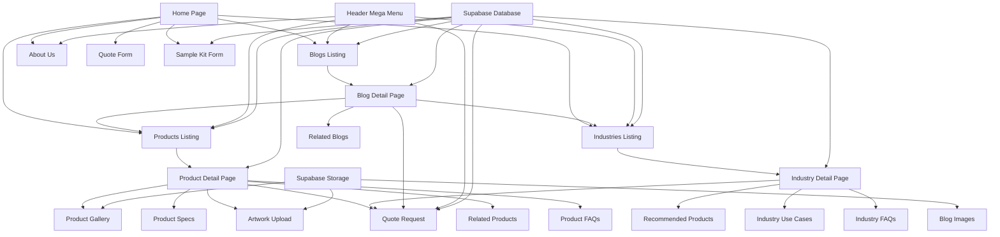
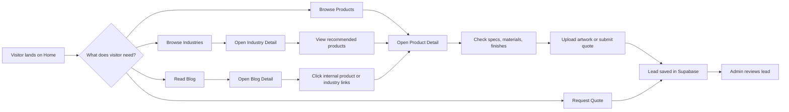
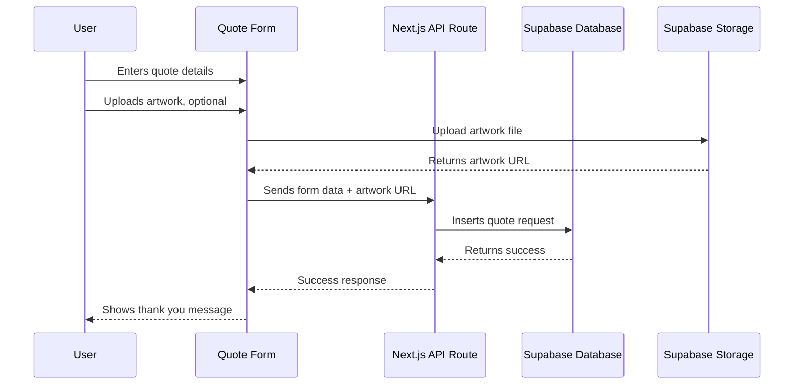
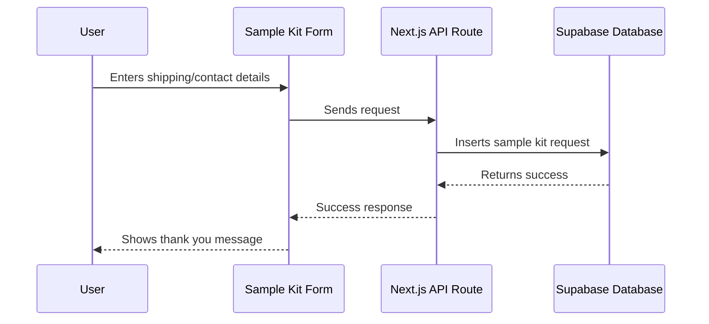

# Next.js + Supabase Website Blueprint

Reference style: Packhelp + noissue  
Project type: Custom packaging website  
Frontend: Next.js App Router  
Backend: Supabase  
Database: PostgreSQL via Supabase  
Auth: Supabase Auth, optional for admin and customer dashboard  
Storage: Supabase Storage  
Target pages: Home, About Us, Blogs, Blog Details, Products Listing, Product Details, Industries Listing, Industry Details

---

## 1. Project Goal

Create a custom packaging website inspired by Packhelp and noissue, but with a simpler page system. The website should include product browsing, industry based category browsing, blog content, quote forms, sample request forms, product detail pages, and a Supabase powered backend.

The site should work like a product discovery and lead generation platform rather than a full checkout store at first.

Main goals:

1. Show packaging products clearly.
2. Let users browse by product type.
3. Let users browse by industry.
4. Let users open product and industry detail pages.
5. Let users submit quote requests.
6. Let users submit sample kit requests.
7. Let admin manage products, industries, blogs, FAQs, testimonials, and leads from Supabase.
8. Keep the structure ready for future checkout, customer accounts, live pricing, and design upload features.

---

## 2. Reference Website Feature Summary

### Packhelp Inspired Features

Packhelp uses a strong product discovery structure. It has packaging categories, product detail pages, industry based navigation, samples, deals, quote flow, case studies, blog content, search, cart, region selector, and platform features such as design, sourcing, warehousing, flexible payments, whitelabel stores, and packaging API.

Important features to copy in structure:

1. Mega menu with product categories.
2. Industry based browsing.
3. Product cards with images and quick details.
4. Product detail pages with specifications.
5. Sample kit CTA.
6. Quote request CTA.
7. Blog and inspiration content.
8. Case study style sections.
9. Sustainability positioning.
10. Customer trust sections.
11. Search modal.
12. Product advisory/contact flow.
13. Design and upload artwork concept.
14. Related products and recommended industry products.

### noissue Inspired Features

noissue focuses heavily on sustainable packaging, simple shopping flow, low minimums, product category browsing, product detail pages, custom branding, sample kits, blog education, and eco-friendly materials.

Important features to copy in structure:

1. Clean visual product cards.
2. Sustainability first messaging.
3. Product and material badges.
4. Use case based sections.
5. Blog education for packaging decisions.
6. Brand story and About Us style positioning.
7. Sample kit / custom packaging CTA.
8. Category based browsing.
9. Customer examples.
10. Helpful FAQs.

---

## 3. Required Pages

The project will include these main pages:

1. Home
2. About Us
3. Blogs Listing
4. Blog Details
5. Products Listing
6. Product Details
7. Industries Listing
8. Industry Details

Although this is more than 5 to 6 URL types, it keeps the required structure clean because listing and detail pages are separate route templates.

---

## 4. Recommended Tech Stack

```txt
Frontend: Next.js 15 App Router
Language: TypeScript
Styling: Tailwind CSS
UI Components: shadcn/ui
Database: Supabase PostgreSQL
Auth: Supabase Auth
Storage: Supabase Storage
Forms: React Hook Form + Zod
Icons: Lucide React
Animations: Framer Motion
SEO: Next Metadata API
CMS Approach: Supabase tables as custom lightweight CMS
Deployment: Vercel
```

---

## 5. High Level Feature Map

```txt
Website
 ├─ Global Layout
 │   ├─ Announcement Bar
 │   ├─ Header
 │   ├─ Mega Menu
 │   ├─ Mobile Menu
 │   ├─ Search Modal
 │   └─ Footer
 │
 ├─ Home Page
 │   ├─ Hero
 │   ├─ Product Categories
 │   ├─ Top Packaging Styles
 │   ├─ How It Works
 │   ├─ Design / Upload Artwork Preview
 │   ├─ Industries Preview
 │   ├─ Sustainability Section
 │   ├─ Testimonials
 │   ├─ Blog Preview
 │   └─ Quote CTA
 │
 ├─ Products
 │   ├─ Product Listing
 │   ├─ Product Filters
 │   ├─ Product Search
 │   ├─ Product Detail
 │   ├─ Product Gallery
 │   ├─ Product Specs
 │   ├─ Quantity / Quote Form
 │   ├─ Artwork Upload
 │   ├─ FAQs
 │   └─ Related Products
 │
 ├─ Industries
 │   ├─ Industries Listing
 │   ├─ Industry Detail
 │   ├─ Recommended Products
 │   ├─ Use Cases
 │   ├─ Industry FAQs
 │   └─ Quote CTA
 │
 ├─ Blogs
 │   ├─ Blog Listing
 │   ├─ Blog Category Filter
 │   ├─ Blog Detail
 │   ├─ Related Blogs
 │   └─ Product / Industry Internal Links
 │
 └─ Forms
     ├─ Quote Request
     ├─ Sample Kit Request
     ├─ Newsletter Signup
     └─ Contact Sales
```

---

## 6. Feature Connection Diagram



---

## 7. User Journey Diagram



---

## 8. Next.js Project Structure

```txt
packaging-website/
 ├─ app/
 │   ├─ (site)/
 │   │   ├─ layout.tsx
 │   │   ├─ page.tsx
 │   │   ├─ about-us/
 │   │   │   └─ page.tsx
 │   │   ├─ blogs/
 │   │   │   ├─ page.tsx
 │   │   │   └─ [slug]/
 │   │   │       └─ page.tsx
 │   │   ├─ products/
 │   │   │   ├─ page.tsx
 │   │   │   └─ [slug]/
 │   │   │       └─ page.tsx
 │   │   ├─ industries/
 │   │   │   ├─ page.tsx
 │   │   │   └─ [slug]/
 │   │   │       └─ page.tsx
 │   │   └─ search/
 │   │       └─ page.tsx
 │   │
 │   ├─ admin/
 │   │   ├─ layout.tsx
 │   │   ├─ page.tsx
 │   │   ├─ products/
 │   │   │   └─ page.tsx
 │   │   ├─ industries/
 │   │   │   └─ page.tsx
 │   │   ├─ blogs/
 │   │   │   └─ page.tsx
 │   │   ├─ leads/
 │   │   │   └─ page.tsx
 │   │   └─ settings/
 │   │       └─ page.tsx
 │   │
 │   ├─ api/
 │   │   ├─ quote/
 │   │   │   └─ route.ts
 │   │   ├─ sample-kit/
 │   │   │   └─ route.ts
 │   │   ├─ newsletter/
 │   │   │   └─ route.ts
 │   │   └─ upload-artwork/
 │   │       └─ route.ts
 │   │
 │   ├─ globals.css
 │   └─ sitemap.ts
 │
 ├─ components/
 │   ├─ global/
 │   │   ├─ AnnouncementBar.tsx
 │   │   ├─ Header.tsx
 │   │   ├─ MegaMenu.tsx
 │   │   ├─ MobileMenu.tsx
 │   │   ├─ SearchModal.tsx
 │   │   ├─ Footer.tsx
 │   │   └─ Breadcrumbs.tsx
 │   │
 │   ├─ home/
 │   │   ├─ Hero.tsx
 │   │   ├─ ProductCategories.tsx
 │   │   ├─ TopPackagingStyles.tsx
 │   │   ├─ HowItWorks.tsx
 │   │   ├─ DesignUploadPreview.tsx
 │   │   ├─ IndustriesPreview.tsx
 │   │   ├─ SustainabilitySection.tsx
 │   │   ├─ Testimonials.tsx
 │   │   ├─ BlogPreview.tsx
 │   │   └─ FinalCTA.tsx
 │   │
 │   ├─ products/
 │   │   ├─ ProductGrid.tsx
 │   │   ├─ ProductCard.tsx
 │   │   ├─ ProductFilters.tsx
 │   │   ├─ ProductSearch.tsx
 │   │   ├─ ProductGallery.tsx
 │   │   ├─ ProductSpecs.tsx
 │   │   ├─ MaterialOptions.tsx
 │   │   ├─ FinishOptions.tsx
 │   │   ├─ QuantitySelector.tsx
 │   │   ├─ ArtworkUpload.tsx
 │   │   ├─ ProductFAQ.tsx
 │   │   └─ RelatedProducts.tsx
 │   │
 │   ├─ industries/
 │   │   ├─ IndustryGrid.tsx
 │   │   ├─ IndustryCard.tsx
 │   │   ├─ IndustryHero.tsx
 │   │   ├─ IndustryUseCases.tsx
 │   │   ├─ RecommendedProducts.tsx
 │   │   └─ IndustryFAQ.tsx
 │   │
 │   ├─ blogs/
 │   │   ├─ BlogGrid.tsx
 │   │   ├─ BlogCard.tsx
 │   │   ├─ BlogFilters.tsx
 │   │   ├─ BlogContent.tsx
 │   │   ├─ TableOfContents.tsx
 │   │   └─ RelatedBlogs.tsx
 │   │
 │   ├─ forms/
 │   │   ├─ QuoteForm.tsx
 │   │   ├─ SampleKitForm.tsx
 │   │   ├─ NewsletterForm.tsx
 │   │   ├─ ContactSalesForm.tsx
 │   │   └─ FormSuccess.tsx
 │   │
 │   ├─ sections/
 │   │   ├─ CTASection.tsx
 │   │   ├─ FAQAccordion.tsx
 │   │   ├─ TrustBadges.tsx
 │   │   ├─ LogoCloud.tsx
 │   │   ├─ FeatureGrid.tsx
 │   │   └─ ImageTextBlock.tsx
 │   │
 │   └─ ui/
 │       └─ shadcn components
 │
 ├─ lib/
 │   ├─ supabase/
 │   │   ├─ client.ts
 │   │   ├─ server.ts
 │   │   ├─ admin.ts
 │   │   └─ types.ts
 │   ├─ queries/
 │   │   ├─ products.ts
 │   │   ├─ industries.ts
 │   │   ├─ blogs.ts
 │   │   ├─ faqs.ts
 │   │   ├─ testimonials.ts
 │   │   └─ site-settings.ts
 │   ├─ validations/
 │   │   ├─ quote.schema.ts
 │   │   ├─ sample-kit.schema.ts
 │   │   ├─ newsletter.schema.ts
 │   │   └─ contact.schema.ts
 │   ├─ utils.ts
 │   └─ seo.ts
 │
 ├─ types/
 │   ├─ product.ts
 │   ├─ industry.ts
 │   ├─ blog.ts
 │   ├─ form.ts
 │   └─ database.ts
 │
 ├─ public/
 │   ├─ images/
 │   │   ├─ home/
 │   │   ├─ products/
 │   │   ├─ industries/
 │   │   ├─ blogs/
 │   │   └─ logos/
 │   └─ icons/
 │
 ├─ supabase/
 │   ├─ migrations/
 │   ├─ seed.sql
 │   └─ schema.sql
 │
 ├─ .env.local
 ├─ middleware.ts
 ├─ next.config.ts
 ├─ package.json
 ├─ tailwind.config.ts
 ├─ tsconfig.json
 └─ README.md
```

---

## 9. Supabase Database Structure

### Main Tables

```txt
products
product_categories
product_images
product_materials
product_finishes
product_faqs
industries
industry_products
blogs
blog_categories
testimonials
quote_requests
sample_kit_requests
newsletter_subscribers
site_settings
navigation_items
```

---

## 10. Supabase Schema

Use this as the first draft schema.

```sql
create table product_categories (
  id uuid primary key default gen_random_uuid(),
  name text not null,
  slug text unique not null,
  description text,
  image_url text,
  sort_order int default 0,
  is_active boolean default true,
  created_at timestamptz default now()
);

create table products (
  id uuid primary key default gen_random_uuid(),
  category_id uuid references product_categories(id) on delete set null,
  name text not null,
  slug text unique not null,
  short_description text,
  description text,
  hero_image_url text,
  starting_price numeric,
  moq int,
  lead_time text,
  material_summary text,
  printing_options text,
  finishing_options text,
  size_options text,
  sustainability_badges text[],
  meta_title text,
  meta_description text,
  is_featured boolean default false,
  is_active boolean default true,
  created_at timestamptz default now(),
  updated_at timestamptz default now()
);

create table product_images (
  id uuid primary key default gen_random_uuid(),
  product_id uuid references products(id) on delete cascade,
  image_url text not null,
  alt_text text,
  sort_order int default 0,
  created_at timestamptz default now()
);

create table product_materials (
  id uuid primary key default gen_random_uuid(),
  product_id uuid references products(id) on delete cascade,
  name text not null,
  description text,
  image_url text,
  sort_order int default 0
);

create table product_finishes (
  id uuid primary key default gen_random_uuid(),
  product_id uuid references products(id) on delete cascade,
  name text not null,
  description text,
  image_url text,
  sort_order int default 0
);

create table product_faqs (
  id uuid primary key default gen_random_uuid(),
  product_id uuid references products(id) on delete cascade,
  question text not null,
  answer text not null,
  sort_order int default 0
);

create table industries (
  id uuid primary key default gen_random_uuid(),
  name text not null,
  slug text unique not null,
  short_description text,
  description text,
  hero_image_url text,
  icon_url text,
  meta_title text,
  meta_description text,
  is_featured boolean default false,
  is_active boolean default true,
  created_at timestamptz default now(),
  updated_at timestamptz default now()
);

create table industry_products (
  id uuid primary key default gen_random_uuid(),
  industry_id uuid references industries(id) on delete cascade,
  product_id uuid references products(id) on delete cascade,
  sort_order int default 0,
  unique(industry_id, product_id)
);

create table blog_categories (
  id uuid primary key default gen_random_uuid(),
  name text not null,
  slug text unique not null,
  description text,
  created_at timestamptz default now()
);

create table blogs (
  id uuid primary key default gen_random_uuid(),
  category_id uuid references blog_categories(id) on delete set null,
  title text not null,
  slug text unique not null,
  excerpt text,
  content text,
  featured_image_url text,
  author_name text,
  published_at timestamptz,
  meta_title text,
  meta_description text,
  is_published boolean default false,
  created_at timestamptz default now(),
  updated_at timestamptz default now()
);

create table testimonials (
  id uuid primary key default gen_random_uuid(),
  customer_name text not null,
  company_name text,
  quote text not null,
  rating int,
  image_url text,
  is_active boolean default true,
  created_at timestamptz default now()
);

create table quote_requests (
  id uuid primary key default gen_random_uuid(),
  full_name text not null,
  email text not null,
  phone text,
  company_name text,
  product_id uuid references products(id) on delete set null,
  industry_id uuid references industries(id) on delete set null,
  product_name text,
  quantity int,
  size text,
  material text,
  printing text,
  finishing text,
  message text,
  artwork_url text,
  status text default 'new',
  created_at timestamptz default now()
);

create table sample_kit_requests (
  id uuid primary key default gen_random_uuid(),
  full_name text not null,
  email text not null,
  phone text,
  company_name text,
  address text,
  city text,
  state text,
  country text,
  postal_code text,
  message text,
  status text default 'new',
  created_at timestamptz default now()
);

create table newsletter_subscribers (
  id uuid primary key default gen_random_uuid(),
  email text unique not null,
  source text,
  created_at timestamptz default now()
);

create table site_settings (
  id uuid primary key default gen_random_uuid(),
  key text unique not null,
  value jsonb,
  updated_at timestamptz default now()
);

create table navigation_items (
  id uuid primary key default gen_random_uuid(),
  label text not null,
  href text,
  parent_id uuid references navigation_items(id) on delete cascade,
  sort_order int default 0,
  is_active boolean default true,
  created_at timestamptz default now()
);
```

---

## 11. Supabase Storage Buckets

Create these buckets:

```txt
product-images
industry-images
blog-images
testimonial-images
artwork-uploads
site-assets
```

Recommended use:

```txt
product-images       → product cards, product gallery, material images, finish images
industry-images      → industry listing and detail hero images
blog-images          → blog featured images and inline images
testimonial-images   → customer photos or logos
artwork-uploads      → quote form uploaded artwork files
site-assets          → homepage banners, logo cloud, static visual assets
```

---

## 12. Environment Variables

Create `.env.local`:

```env
NEXT_PUBLIC_SUPABASE_URL=your_supabase_project_url
NEXT_PUBLIC_SUPABASE_ANON_KEY=your_supabase_anon_key
SUPABASE_SERVICE_ROLE_KEY=your_service_role_key
NEXT_PUBLIC_SITE_URL=http://localhost:3000
```

Important:

Never expose `SUPABASE_SERVICE_ROLE_KEY` in client components.
Use it only in server actions, API routes, or server side admin logic.

---

## 13. Supabase Client Files

### `lib/supabase/client.ts`

```ts
import { createBrowserClient } from '@supabase/ssr'

export function createClient() {
  return createBrowserClient(
    process.env.NEXT_PUBLIC_SUPABASE_URL!,
    process.env.NEXT_PUBLIC_SUPABASE_ANON_KEY!
  )
}
```

### `lib/supabase/server.ts`

```ts
import { createServerClient } from '@supabase/ssr'
import { cookies } from 'next/headers'

export async function createClient() {
  const cookieStore = await cookies()

  return createServerClient(
    process.env.NEXT_PUBLIC_SUPABASE_URL!,
    process.env.NEXT_PUBLIC_SUPABASE_ANON_KEY!,
    {
      cookies: {
        getAll() {
          return cookieStore.getAll()
        },
        setAll(cookiesToSet) {
          try {
            cookiesToSet.forEach(({ name, value, options }) =>
              cookieStore.set(name, value, options)
            )
          } catch {}
        },
      },
    }
  )
}
```

### `lib/supabase/admin.ts`

```ts
import { createClient } from '@supabase/supabase-js'

export const supabaseAdmin = createClient(
  process.env.NEXT_PUBLIC_SUPABASE_URL!,
  process.env.SUPABASE_SERVICE_ROLE_KEY!
)
```

---

## 14. Query Layer

### `lib/queries/products.ts`

```ts
import { createClient } from '@/lib/supabase/server'

export async function getProducts() {
  const supabase = await createClient()

  const { data, error } = await supabase
    .from('products')
    .select(`
      *,
      product_categories(name, slug),
      product_images(image_url, alt_text, sort_order)
    `)
    .eq('is_active', true)
    .order('created_at', { ascending: false })

  if (error) throw new Error(error.message)
  return data
}

export async function getProductBySlug(slug: string) {
  const supabase = await createClient()

  const { data, error } = await supabase
    .from('products')
    .select(`
      *,
      product_categories(name, slug),
      product_images(*),
      product_materials(*),
      product_finishes(*),
      product_faqs(*)
    `)
    .eq('slug', slug)
    .eq('is_active', true)
    .single()

  if (error) throw new Error(error.message)
  return data
}
```

### `lib/queries/industries.ts`

```ts
import { createClient } from '@/lib/supabase/server'

export async function getIndustries() {
  const supabase = await createClient()

  const { data, error } = await supabase
    .from('industries')
    .select('*')
    .eq('is_active', true)
    .order('created_at', { ascending: false })

  if (error) throw new Error(error.message)
  return data
}

export async function getIndustryBySlug(slug: string) {
  const supabase = await createClient()

  const { data, error } = await supabase
    .from('industries')
    .select(`
      *,
      industry_products(
        products(*)
      )
    `)
    .eq('slug', slug)
    .eq('is_active', true)
    .single()

  if (error) throw new Error(error.message)
  return data
}
```

### `lib/queries/blogs.ts`

```ts
import { createClient } from '@/lib/supabase/server'

export async function getBlogs() {
  const supabase = await createClient()

  const { data, error } = await supabase
    .from('blogs')
    .select('*, blog_categories(name, slug)')
    .eq('is_published', true)
    .order('published_at', { ascending: false })

  if (error) throw new Error(error.message)
  return data
}

export async function getBlogBySlug(slug: string) {
  const supabase = await createClient()

  const { data, error } = await supabase
    .from('blogs')
    .select('*, blog_categories(name, slug)')
    .eq('slug', slug)
    .eq('is_published', true)
    .single()

  if (error) throw new Error(error.message)
  return data
}
```

---

## 15. Page Responsibilities

### Home Page

Path:

```txt
app/(site)/page.tsx
```

Features:

```txt
1. Announcement bar
2. Hero section
3. Product category preview
4. Top packaging styles
5. How it works
6. Upload artwork / design preview block
7. Industry preview
8. Sustainability section
9. Testimonials
10. Latest blogs
11. Final quote CTA
```

Data from Supabase:

```txt
products where is_featured = true
industries where is_featured = true
blogs where is_published = true limit 3
testimonials where is_active = true
site_settings for homepage content
```

---

### About Us Page

Path:

```txt
app/(site)/about-us/page.tsx
```

Features:

```txt
1. Brand story hero
2. Mission section
3. Sustainability promise
4. Production / sourcing capability section
5. Customer trust section
6. Team or process section
7. Quote CTA
```

Data from Supabase:

```txt
site_settings
testimonials
```

---

### Products Listing Page

Path:

```txt
app/(site)/products/page.tsx
```

Features:

```txt
1. Product listing hero
2. Search bar
3. Category filters
4. Material filters
5. Sustainability filters
6. Product grid
7. Product cards
8. Empty state
9. CTA section
```

Product card fields:

```txt
image
name
short description
MOQ
starting price, optional
lead time
badges
view details button
request quote button
```

Data from Supabase:

```txt
products
product_categories
product_images
```

---

### Product Detail Page

Path:

```txt
app/(site)/products/[slug]/page.tsx
```

Features:

```txt
1. Breadcrumbs
2. Product hero
3. Product image gallery
4. Product summary
5. MOQ, lead time, material summary
6. Material options
7. Printing options
8. Finishing options
9. Size options
10. Sustainability badges
11. Artwork upload
12. Quote form
13. Product FAQs
14. Related products
```

Data from Supabase:

```txt
products
product_images
product_materials
product_finishes
product_faqs
quote_requests
```

---

### Industries Listing Page

Path:

```txt
app/(site)/industries/page.tsx
```

Features:

```txt
1. Industries hero
2. Industry cards
3. Short explanation of industry based packaging
4. Recommended product categories section
5. Quote CTA
```

Industry card fields:

```txt
image or icon
industry name
short description
view industry button
```

Data from Supabase:

```txt
industries
```

---

### Industry Detail Page

Path:

```txt
app/(site)/industries/[slug]/page.tsx
```

Features:

```txt
1. Breadcrumbs
2. Industry hero
3. Industry packaging challenges
4. Recommended products
5. Industry use cases
6. Sustainability section
7. Related blogs
8. Industry FAQs
9. Quote CTA
```

Data from Supabase:

```txt
industries
industry_products
products
blogs
quote_requests
```

---

### Blogs Listing Page

Path:

```txt
app/(site)/blogs/page.tsx
```

Features:

```txt
1. Blog hero
2. Blog category filter
3. Search
4. Featured blog
5. Blog grid
6. Pagination or load more
7. Newsletter form
```

Data from Supabase:

```txt
blogs
blog_categories
newsletter_subscribers
```

---

### Blog Detail Page

Path:

```txt
app/(site)/blogs/[slug]/page.tsx
```

Features:

```txt
1. Blog title
2. Featured image
3. Author and publish date
4. Table of contents
5. Content body
6. Internal product links
7. Internal industry links
8. Related blogs
9. Quote CTA
10. Newsletter CTA
```

Data from Supabase:

```txt
blogs
blog_categories
products for internal links
industries for internal links
```

---

## 16. Form Flow

### Quote Form Flow



Quote form fields:

```txt
full_name
email
phone
company_name
product_id
industry_id
product_name
quantity
size
material
printing
finishing
message
artwork_file
```

---

### Sample Kit Form Flow



Sample kit fields:

```txt
full_name
email
phone
company_name
address
city
state
country
postal_code
message
```

---

## 17. API Routes

### `app/api/quote/route.ts`

Purpose:

```txt
Receive quote request form data and save it to Supabase.
```

Logic:

```txt
1. Validate request body with Zod.
2. Insert data into quote_requests.
3. Return success or error.
4. Optional: send email notification later.
```

### `app/api/sample-kit/route.ts`

Purpose:

```txt
Receive sample kit request and save it to Supabase.
```

### `app/api/newsletter/route.ts`

Purpose:

```txt
Save newsletter subscriber email.
```

### `app/api/upload-artwork/route.ts`

Purpose:

```txt
Upload artwork file to Supabase Storage and return file URL.
```

---

## 18. Admin Panel Scope

Admin can be added under `/admin`.

Minimum admin features:

```txt
1. View quote requests
2. View sample kit requests
3. Add/edit/delete products
4. Add/edit/delete industries
5. Add/edit/delete blogs
6. Upload product images
7. Upload blog images
8. Manage FAQs
9. Manage testimonials
10. Manage homepage settings
```

Admin auth:

```txt
Supabase Auth
Only approved admin emails can access /admin
Use middleware.ts to protect admin routes
```

---

## 19. Routing Structure

```txt
/                         → Home
/about-us                 → About Us
/products                 → Products Listing
/products/[slug]          → Product Detail
/industries               → Industries Listing
/industries/[slug]        → Industry Detail
/blogs                    → Blogs Listing
/blogs/[slug]             → Blog Detail
/search                   → Search Page
/admin                    → Admin Dashboard
/admin/products           → Product Management
/admin/industries         → Industry Management
/admin/blogs              → Blog Management
/admin/leads              → Quote and Sample Leads
/admin/settings           → Site Settings
```

---

## 20. Component Data Connections

```txt
Header.tsx
 └─ navigation_items
 └─ product_categories
 └─ industries

MegaMenu.tsx
 └─ product_categories
 └─ products featured only
 └─ industries featured only

Home Hero
 └─ site_settings

ProductCategories.tsx
 └─ product_categories

TopPackagingStyles.tsx
 └─ products where is_featured = true

IndustriesPreview.tsx
 └─ industries where is_featured = true

Testimonials.tsx
 └─ testimonials where is_active = true

BlogPreview.tsx
 └─ blogs where is_published = true limit 3

ProductGrid.tsx
 └─ products
 └─ product_categories

ProductDetail.tsx
 └─ products
 └─ product_images
 └─ product_materials
 └─ product_finishes
 └─ product_faqs

IndustryDetail.tsx
 └─ industries
 └─ industry_products
 └─ products

BlogDetail.tsx
 └─ blogs
 └─ blog_categories
```

---

## 21. SEO Plan

Every page should use the Next.js Metadata API.

### Product Detail SEO

Use:

```txt
meta_title from products table
meta_description from products table
canonical URL
Open Graph image from hero_image_url
Product schema, optional later
FAQ schema from product_faqs
```

### Industry Detail SEO

Use:

```txt
meta_title from industries table
meta_description from industries table
canonical URL
Open Graph image from hero_image_url
FAQ schema, optional
```

### Blog Detail SEO

Use:

```txt
meta_title from blogs table
meta_description from blogs table
canonical URL
Open Graph image from featured_image_url
Article schema
```

---

## 22. Suggested Product Categories

```txt
Boxes
 ├─ Mailer Boxes
 ├─ Shipping Boxes
 ├─ Product Boxes
 ├─ Folding Cartons
 ├─ Rigid Boxes

Bags
 ├─ Paper Bags
 ├─ Cotton Bags
 ├─ Poly Mailers
 ├─ Paper Mailing Bags

Accessories
 ├─ Tissue Paper
 ├─ Stickers
 ├─ Labels
 ├─ Tape
 ├─ Ribbon
 ├─ Fillers

Food Packaging
 ├─ Pizza Boxes
 ├─ Cups
 ├─ Cup Sleeves
 ├─ Food Containers

Pouches
 ├─ Stand Up Pouches
 ├─ Flat Pouches
 ├─ Mylar Bags

Samples
 ├─ Sample Kit
```

---

## 23. Suggested Industries

```txt
Apparel & Fashion
Health & Beauty
E-commerce
Food & Drinks
Marketing & Events
Electronics
Gifts
Home & Decor
Logistics & Fulfillment
CBD & Wellness
Bakery
Coffee & Tea
Pet Products
Supplements
Candles
Soap
Jewelry
```

---

## 24. UI Sections Inspired by Packhelp and noissue

### Header

```txt
Logo
Packaging menu
Industries menu
Blogs
About Us
Search icon
Get Quote button
Sample Kit button
Mobile hamburger menu
```

### Mega Menu

```txt
Left column: Product groups
Middle column: Product links
Right column: Featured CTA cards
Bottom row: Sample kit, deals, contact sales
```

### Product Cards

```txt
Product image
Product name
Short use case line
MOQ badge
Eco badge
Lead time badge
View details CTA
Request quote CTA
```

### Product Detail

```txt
Sticky right quote panel on desktop
Gallery on left
Specs below hero
Materials and finishes as cards
Artwork upload area
FAQ accordion
Related products carousel
```

### Industry Detail

```txt
Industry hero
Packaging problems section
Recommended product cards
Use cases
Sustainability notes
CTA block
Related blogs
```

---

## 25. Recommended Install Commands

```bash
npx create-next-app@latest packaging-website --typescript --tailwind --eslint --app --src-dir false
cd packaging-website
npm install @supabase/supabase-js @supabase/ssr
npm install react-hook-form zod @hookform/resolvers
npm install lucide-react framer-motion
npx shadcn@latest init
```

Suggested shadcn components:

```bash
npx shadcn@latest add button card input textarea select checkbox dialog sheet accordion badge tabs dropdown-menu
```

---

## 26. Build Order for AI Agent

Follow this order:

```txt
Step 1: Create base Next.js project.
Step 2: Install Tailwind, Supabase, shadcn/ui, Zod, React Hook Form.
Step 3: Create project folders exactly as listed.
Step 4: Create Supabase schema and storage buckets.
Step 5: Add Supabase client, server, and admin helpers.
Step 6: Create query functions for products, industries, blogs, FAQs, testimonials.
Step 7: Build global layout, header, mega menu, mobile menu, footer.
Step 8: Build Home page sections.
Step 9: Build Products Listing page with filters.
Step 10: Build Product Detail page.
Step 11: Build Industries Listing page.
Step 12: Build Industry Detail page.
Step 13: Build Blogs Listing page.
Step 14: Build Blog Detail page.
Step 15: Build Quote Form and Sample Kit Form.
Step 16: Connect forms to Supabase API routes.
Step 17: Add SEO metadata for all dynamic pages.
Step 18: Add sitemap.
Step 19: Add admin routes.
Step 20: Test full flow from product page to quote request.
```

---

## 27. AI Agent Prompt

Use this prompt in Cursor or any coding agent:

```txt
Create a Next.js 15 App Router website using TypeScript, Tailwind CSS, shadcn/ui, and Supabase. Build a custom packaging website inspired by Packhelp and noissue, but do not copy their exact branding, images, or text.

Use the exact project structure from this markdown file.

Required public pages:
1. Home
2. About Us
3. Products Listing
4. Product Details
5. Industries Listing
6. Industry Details
7. Blogs Listing
8. Blog Details

Use Supabase as the backend database. Create query files in lib/queries. Create Supabase helper files in lib/supabase. Add API routes for quote request, sample kit request, newsletter signup, and artwork upload.

Build reusable components for Header, MegaMenu, MobileMenu, Footer, ProductGrid, ProductCard, ProductFilters, ProductGallery, QuoteForm, SampleKitForm, IndustryGrid, BlogGrid, and FAQAccordion.

Use server components for data fetching wherever possible. Use client components only for filters, forms, modals, upload fields, and interactive UI.

Create clean, professional, responsive UI with packaging product cards, industry cards, blog cards, quote CTAs, sample kit CTAs, sustainability sections, and trust sections.

Do not create checkout yet. Focus on product discovery and lead generation. All quote and sample kit submissions must be saved in Supabase.
```

---

## 28. Future Features

Add later after the base site works:

```txt
1. Customer dashboard
2. Saved quote history
3. Live pricing calculator
4. Product configurator
5. 3D packaging preview
6. Cart system
7. Stripe checkout
8. CRM integration
9. Email notifications
10. Admin content editor
11. Multi-language support
12. Region selector
13. Packaging API
14. Whitelabel store flow
15. Warehousing request module
```

---

## 29. Final Notes

This structure gives the AI agent a complete build plan. Start with the public website and Supabase database first. Keep checkout and advanced design editor features for phase two.

The most important flow is:

```txt
Home → Product Listing → Product Detail → Quote Form → Supabase Lead
```

The second most important flow is:

```txt
Home → Industries Listing → Industry Detail → Recommended Products → Product Detail → Quote Form
```

The third most important flow is:

```txt
Blog Listing → Blog Detail → Internal Product Links → Product Detail → Quote Form
```
